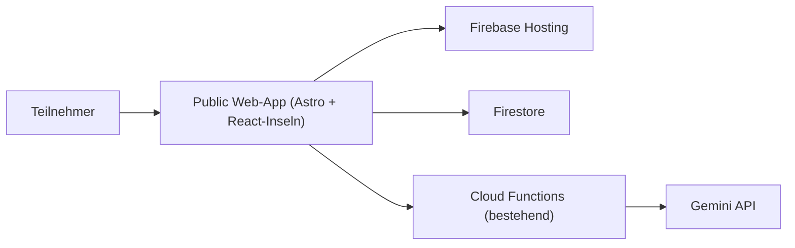

# Architektur

Stand: 18.02.2026

## Systemkontext

## Schichtenmodell

### 1) Presentation Layer (`site/src/pages`, `site/src/layouts`)
- Astro-Seiten als statische Shells
- Navigations- und Basislayout in `site/src/layouts/BaseLayout.astro`
- Public-Routen sind deutschsprachig und sprechend
- Rechtliche Pflichtseiten sind statisch als Astro-Seiten umgesetzt (`/impressum`, `/datenschutz`)

### 2) Interactive Islands (`site/src/components/react`)
- `CategoriesExplorer.tsx`
- `SessionsExplorer.tsx`
- `ExercisesExplorer.tsx`
- Aufgabe: Such-/Filterlogik und Detaildarstellung auf Basis des URL-Pfads

### 3) Data Layer (`site/src/lib`)
- `firebase.ts`: Firebase-App/Firestore-Initialisierung
- `content.ts`: Laden und Normalisieren von Stunden und Uebungen
- In-Memory-Cache mit TTL von 5 Minuten
- Typvertrag in `types.ts`

### 4) Backend Layer (`functions/src/index.ts`)
- Bestehende Callable Functions bleiben im Repository
- Der aktuelle Public-Frontend-Stand nutzt sie nicht aktiv fuer den Kernflow

## Kernprozesse

### Oeffentliche Inhalte laden
1. Astro rendert die statische Seitenhuelle.
2. React-Insel laedt Daten aus Firestore (`sessions`, `exercises`).
3. Daten werden normalisiert und 5 Minuten gecacht.
4. Suche/Filter laufen clientseitig auf dem geladenen Datensatz.

### Detailseiten
- `/stunden/:kategorieSlug/:stundenSlug`, `/uebungen/:uebungSlug`
- Firebase Hosting rewrites leiten dynamische Unterpfade auf die jeweilige Index-Seite.
- Die jeweilige Insel liest den Pfad und zeigt den passenden Detailinhalt an.
- Fuer `Stunden` bleibt die Query-Variante (`/stunden?cat=...&slug=...`) aus Kompatibilitaetsgruenden zulaessig.
- Mobile Darstellung in `Stunden`-Details nutzt ein Phasen-Accordion (erste Phase offen, weitere geschlossen).

### Statische Rechtsseiten
- `/impressum`, `/datenschutz`
- Werden ohne Client-Logik direkt als statische Astro-Seiten ausgeliefert.

## Datenmodell (genutzt im Public-Frontend)

- `sessions`: veroeffentlichte Stunden (`status == published`)
- `exercises`: Uebungsbibliothek

## Nicht mehr Teil der aktuellen Frontend-Architektur

- React Router SPA fuer Public
- PWA/Service Worker im Public-Frontend
- Theme-Switch und Ratings im Public-Frontend
- Admin-Frontend
