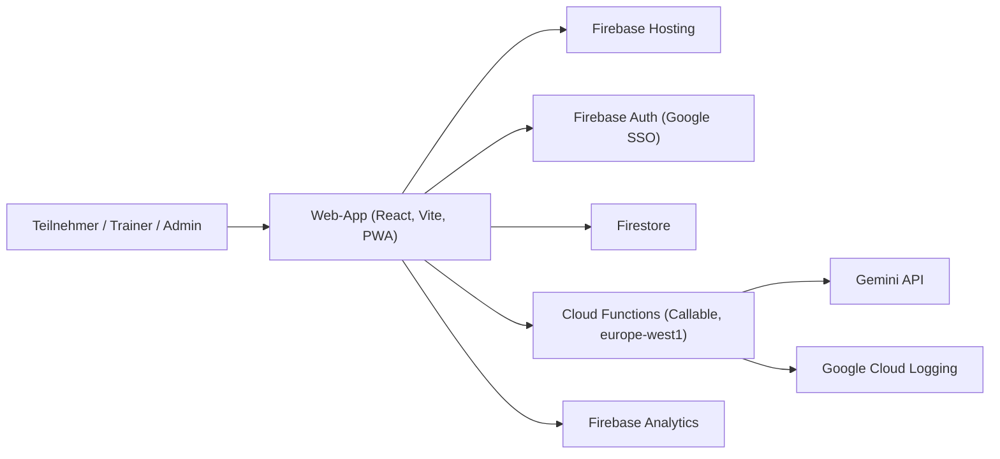

# Architektur

Stand: 17.02.2026

## Systemkontext

## Schichtenmodell

### 1) Presentation Layer (`site/src`)
- React Router mit oeffentlichen Routen und Admin-Routen
- globale Layouts (`PageLayout`, `AdminLayout`)
- Designsystem in `site/src/index.css`
- Theme-Umschaltung per `ThemeProvider`

### 2) Application Layer (`site/src/contexts`, `site/src/hooks`)
- `AuthContext`: Auth-Status, Rollen, Login/Logout
- `ContentContext`: Laden von Kategorien, Sessions, Exercises aus Firestore
- Hooks fuer Suche, Ratings, Analytics

### 3) Data Access Layer (`site/src/firebase`, `site/src/content`)
- typisierte Firestore-Operationen (`site/src/firebase/firestore.ts`)
- Loader mit Caching (`site/src/content/*-firestore.ts`, 5 Minuten TTL)
- Auth-Hilfen inkl. Einladungssystem (`site/src/firebase/auth.ts`)

### 4) Backend Layer (`functions/src/index.ts`)
- Firebase Callable Functions mit:
  - App Check Enforcement
  - Auth-Pruefung
  - Rate Limiting in Firestore (Transaktionen)
- KI-Features (Stunden- und Uebungsgenerierung) via Gemini
- Fehler-Logging fuer Clientfehler

## Kernprozesse

### Oeffentliche Inhalte laden
1. App startet, `ContentProvider` laedt Kategorien, Sessions, Exercises aus Firestore.
2. Nur `published` Sessions werden oeffentlich angezeigt.
3. Ergebnisse werden clientseitig gecacht.

### Trainer/Admin Login
1. Login ueber Google Popup.
2. Wenn erster User: automatische Admin-Rolle und `config/admin`.
3. Sonst nur Registrierung mit gueltiger Einladung.
4. Rollen aus `users/{uid}` steuern den Zugriff im UI und in Firestore Rules.

### KI-Builder und Entwuerfe
1. Admin/Trainer ruft Callable Function (`generateSession` oder `suggestExercises`) auf.
2. Function prueft App Check + Auth + Rate Limit.
3. Gemini liefert JSON, Frontend speichert Ergebnis als Draft.
4. Admin kann Draft freigeben; daraus wird eine publizierte Session.

### Bewertungen
1. Nutzer gibt Sternebewertung fuer Session/Uebung.
2. Aggregat wird in `ratings/{targetType_targetId}` gespeichert.
3. Eigene Bewertung liegt in `localStorage`, damit Aenderungen konsistent bleiben.

## Datenmodell (Firestore)

- `sessions`: Trainingsstunden (`status: draft|published`)
- `exercises`: Uebungsbibliothek
- `categories`: Kategorien mit Metadaten
- `drafts`: KI- und manuelle Entwuerfe
- `groups`: Trainergruppen mit Einschraenkungen
- `users`: Rollen und Profildaten
- `invitations`: Einladung fuer Trainer/Admin-Onboarding
- `ratings`: aggregierte Sternebewertungen
- `analytics`: Seitenaufrufe und Kennzahlen
- `config`: globale Konfiguration (z. B. Session-Regeln)
- `rateLimits`: Server-seitige KI-Request-Historie
- `generationJobs`: Bulk-Generierung mit Jobstatus

## Sicherheit

- Firestore Rules mit rollenbasierten Guards (`admin`, `trainer`, owner)
- Cloud Functions mit `enforceAppCheck: true` bei sicherheitsrelevanten Endpunkten
- KI-Endpunkte nur authentifiziert nutzbar
- Admin-Bereiche sowohl im UI als auch serverseitig abgesichert
